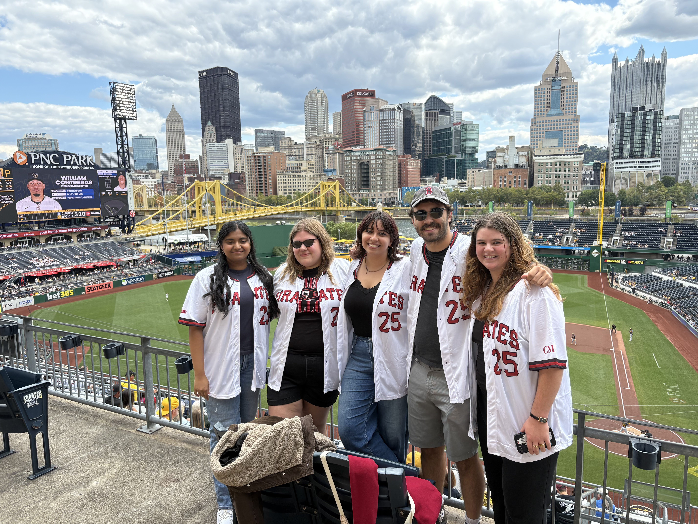
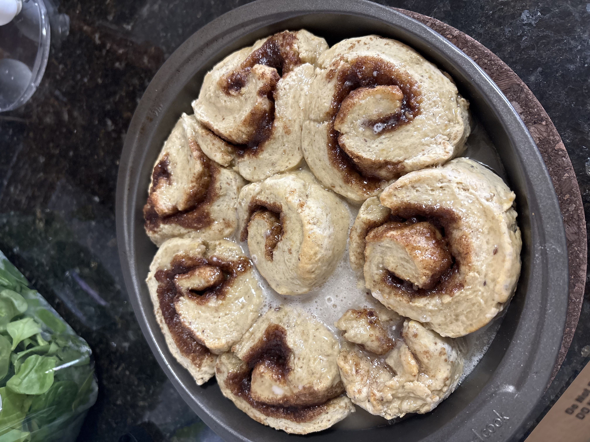
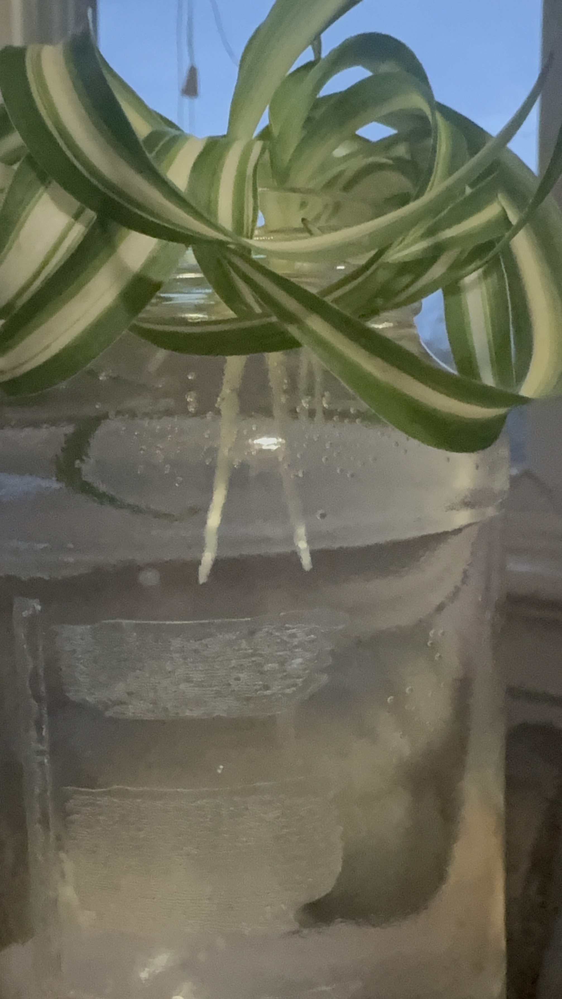

| [home page](README.md) | [data viz examples](dataviz-examples) | [critique by design](critique-by-design) | [final project I](final-project-part-one) | [final project II](final-project-part-two) | [final project III](final-project-part-three) |

# Portfolio
This is my public portfolio for Telling Stories with Data at CMU!  Check out all the cool projects I learned how to create through this class. 

# About me
Hi! My name is Caroline Ridge (she/her) and I am a first-year MSPPM student on the D.C. Track. This is my first ever class using Tableau or Github for data visualization projects, so I am very excited to learn some new skills and hone in my data visualization skills. 

# Who I am
Check out these pictures to learn a little bit more about me and my hobbies! 

   

# What I hope to learn
Everything there is to learn! I want to become a wiz at data visualization. But more specifically, here is what I *really* want to learn. 

1. Effectively use data visualizations to tell a story. 
2. Accessible ways to present data to multiple stakeholders. 
3. How to build my own portfolio!  

After graduation, I hope to work in a think tank, which is why learning how to present data in an honest and transparent way is important. 
# Portfolio

# Examples

## Assignment: [Visualizing Government Debt](visualizinggovernmentdebt)
For this assignment, make sure you set up and link to a new page.  This page is linking to a new Markdown document called `visualizing-government-debt.md`.  For links to Markdown files in your repository, you can just include the name of the page without the `.md` extension. 

## Assignment 3&4: [Critique by Design](critique-by-design)
For this assignment, make sure you set up and link to a new page.  This page is linking to a new Markdown document called `critique-by-design.md`.  

## Final project
Here it might be helpful to include a high-level description of your final project. 
[Part I](final-project-part-one) 
[Part II](final-project-part-two)
[Part III](final-project-part-three)

---

## References
No references! 

## AI acknowledgements
No AI use! 

