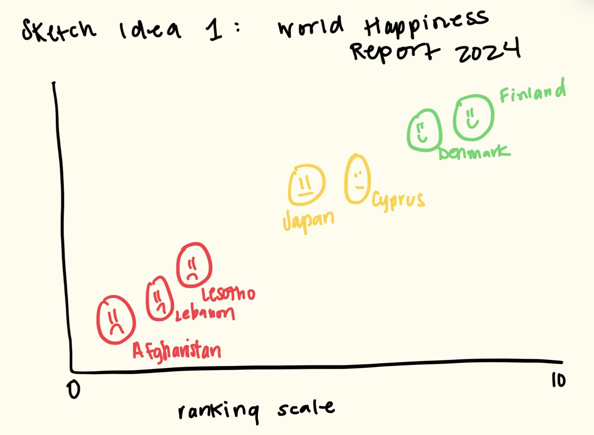
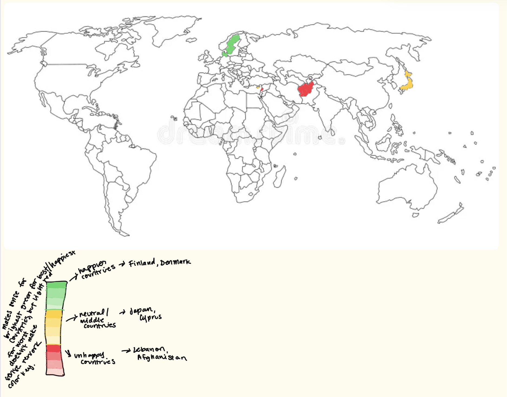

| [home page](https://cridge14.github.io/caroline-ridge-portfolio/) | [data viz examples](dataviz-examples) | [critique by design](critique-by-design) | [final project I](final-project-part-one) | [final project II](final-project-part-two) | [final project III](final-project-part-three) |

# Critique By Design 
Check out my Critique By Design! For this assignment, we recreated a visualization from [MakeOverMondays](https://makeovermonday.co.uk/). We critiqued, conducted interviews with other students, and redesigned based on this feedback. 

## Step one: the visualization
For my visualization that I wanted to critique and re-design, I chose to look at the 2024 World Happiness Report. [You can see the visualization here](https://www.worldhappiness.report/ed/2024/happiness-of-the-younger-the-older-and-those-in-between/#ranking-of-happiness-2021-2023). The World Happiness Report is calculated through this process: The first way is taking a sample of 1000 constituents in each of the 143 countries represented, and having them rank (on a 1-10 scale) their current lives. For each report calculated, the data analyst take a three-year average (i.e. for the 2024 World Happiness Report, it uses data from surveys collected from 2021-2023). 

Researchers then use 6 key factors to explain *why* countries differ in happiness (note: they are not using these to calculate the score itself). The six key factors are: Log GDP per capita, social support, healthy life expectancy, freedom to make life choices, generosity, and freedom from corruption. The baseline "dystopia" society is used as a comparison for all countries, and is the lowest possible value of all of these factors. 

## Step two: the critique
You can see my critique for the originial visualization of the 2024 World Happiness Report Below: 

* Usefulness: 6/10
* Completeness: 6/10
* Perceptibility: 8/10
* Truthfulness: 9/10
* Intuitiveness: 3/10
* Aesthetics: 4/10
* Engagement: 6/10

Using Stephen's Few "Data Visualization Effectiveness Profile", I scored several aspects of the original visualization. I ranked categories such as the usefulness, perceptibilty, and truthfulness quite high, because I do believe the visualization excelled in these categories. I think the visualization is something that is interesting to look at, and I think people may care how their country compares to others, especially from a human rights watchdog perspective. I also believe that the original visualization, albeit boring, did a good job at presenting the data in an accurate way. 

I ranked some of the other features, such as the intuitiveness and aesthetics, on the lower side for the original visualization. Specifically for the intuitiveness, the visualization, and quite frankly the World Happiness Report itself, needs background information to understand how to interpret the data. Readers may get confused and think that the 6 key factors determine the happiness score, but as explained above, that is not the case. The baseline group of dystopia was even confusing for me at first, as I thought it was one of the key factors, but in reality it serves as the baseline group. I want to redesign the visualization to be more intuitive, and also more fun to look at! 

When analyzing the target audience for this visualization, and the report itself, it is a little hard to narrow down *who* exactly is interested in this type of report. Policy students, such as myself, would generally be interested in this report, as it shows global comparison of perceived happiness in countries. In the more recent years, I can also see the general public being interested in this report, as global democratic-backsliding, political volatility, and hostile international relations continue to worsen. This report can also be used to show change over time, perhaps comparing world happiness from pre-to-post COVID. At a surface level, I do believe this visualization shows the intended message- it provides an overall happiness score by country and ranks it from most happy to least happy, which makes it easier for readers to interpret. 

For my re-design, I really want to focus on the aesthetics of the visualization, and presenting the data in a way that is easy to interpret without having to try to hard. I came up with two re-design ideas below! 

## Step three: Sketch a solution

For this project, I initially came up with two sketch ideas. This is Sketch Idea #1: 

 

For sketch idea 1, the idea was to represent the countries in different emotional faces. So, countries that rank relatively high on the index (those above a 5 rating) would be represented with smiley faces, those with neutral ratings (between 3-5) would be represented with "meh" faces, and then countries that rank relatively poorly (below a 3) would be represented with frowney faces. I also incorporated a color scale (even though I need to be aware of color-blindness, something that will be brought up later in this discussion) to show positive/ happy emotions, and then negative/ sad emotions. I thought this would be a more fun, creative way to show the same data. 

This is my second sketch idea: 
 

For sketch idea 2, I wanted to do a more general visualization than the smiley/frowney face idea. I kept the color scale very similar to above, using darker green to represent the happier countries, and dark red to represent the least happy countries. I thought the map was a cool idea, and readers could not only compare countries, but also regions (i.e. Nordic countries rank higher than countries in the Middle East). 

## Step four: Test the solution

The next steps were to get feedback on my visualizations. I did this in two separate ways: 
* Simple poll on which visualization people liked better
* in-depth interviews to find the reasons *why* they liked one visualization better than the other.

I received a lot of in-sight through both of these methods. Below are my results: 

Questions: 
* Which visualization initially stood out to you?
* Without knowing any further data, what story are these visualizations telling? And which tells it better?
* If you could change one thing about the visualization, what would you change?
* Any other general feedback?

Synthesis: 
For the poll itself, the map won the overall votes (10-2). As for the interview questions, I gained some valuable insight from discussing them with 3 other PPM students. The major insight was the color scale for both visualizations. They currently were not very accessible for individuals with red-green color blindness, which was definitely something I forgot to consider when designing these sketches. I did remember, however, that Tableau had set color gradients that passed accessibility concerns, which included a red-green color scale. 

Comparing the two visualizations, my audience made some very good points. Firstly, they acknowledged that while my sketch idea #1 only included a view countries, when I would build it fully out in Tableau, there would be 143 countries represented, which is a HUGE number of countries in a graphic like that. The faces would most likely overlap (I didn't actually build this out in Tableau, but it's most likely true) and there would just be too much noise. They also brought up the fact that in my current graph, the y-axis had no values. This would only contribute further to the clutteredness. As for my map visualization, there was not too much feedback brought up about that, besides making sure my color scale is accessible. Ulimately, after reviewing all the feedback, I decided to go with sketch idea #2 for my final visualization. 

## Step five: build the solution
Here is the solution that I decided to build for class. 

<noscript></noscript><object class='tableauViz'  style='display:none;'><param name='host_url' value='https%3A%2F%2Fpublic.tableau.com%2F' /> <param name='embed_code_version' value='3' /> <param name='site_root' value='' /><param name='name' value='TSWDCritiqueByDesign&#47;Sketch1' /><param name='tabs' value='no' /><param name='toolbar' value='yes' /><param name='static_image' value='https:&#47;&#47;public.tableau.com&#47;static&#47;images&#47;TS&#47;TSWDCritiqueByDesign&#47;Sketch1&#47;1.png' /> <param name='animate_transition' value='yes' /><param name='display_static_image' value='yes' /><param name='display_spinner' value='yes' /><param name='display_overlay' value='yes' /><param name='display_count' value='yes' /><param name='language' value='en-US' /></object>
                

I had a really fun time building this in Tableau, and it was so much easier than other data visualization tools I've used that create the same content (I'm looking at you, R Studio). I ended up using a red-green color scale, but chose one of the pre-created Tableau ones, which is vetted for accessibility concerns. I really enjoy that the map is interactive, it does a good job at showing comparisons by countries and regions, and (at least in my opinion) is much more fun to look at and interact with than the original visualization was. I tried to also build out my sketch idea #1 in Tableau, but ran into many issues. I am curious, though, what it would have looked like if it was created! 

## References
[2024 World Happiness Report](https://www.worldhappiness.report/ed/2024/happiness-of-the-younger-the-older-and-those-in-between/#ranking-of-happiness-2021-2023)

## AI acknowledgements
I used CoPilot to help me create the visualization. It helped me load the correct fields into Tableau to create the map outline, and then also to visualize the color scale from the happiness index. That was the only way I used AI for this assignment. 
