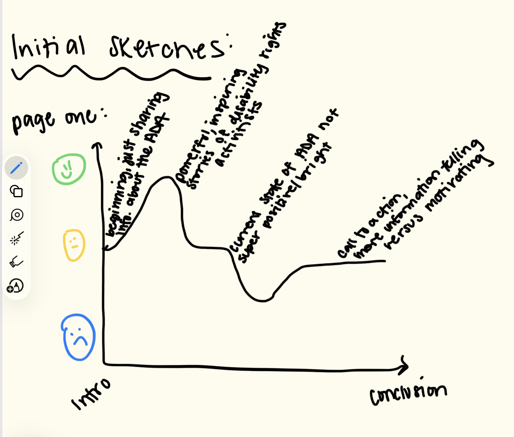

| [home page](https://cridge14.github.io/caroline-ridge-portfolio/) | [data viz examples](dataviz-examples) | [critique by design](critique-by-design) | [final project I](final-project-part-one) | [final project II](final-project-part-two) | [final project III](final-project-part-three) |

Read below to gain some insight into the early planning stages of my final project! For this part of the assignment, we broke down the project to its core. We analyzed what story we wanted to tell, the best way to tell said story, and how to find publicly accessible data to aid in our storytelling. 

# Outline
For my project, I really want to focus on the history of the Americans with Disabilities Act. Instead of focusing on the data and timeline, I want to give a voice to people with disabilities and tell their story of the progress, and remaining work to still be done. I also want to focus on several different areas of social justice that intersect with accessibility and disability justice, including healthcare, transportation, and higher education. And then lastly, to end on a relatable note for my fellow CMU peers, I want to show how CMU consists to be inaccesible for users with mobility issues and wheelchair users. 

The main tab/page/story for my final project will be the history of the Americans with Disabilities Act (ADA). For this main page, I will have a couple subsections, including a general overview of the ADA, the disability rights movement/ post & pre ADA, and then the current state of the ADA. Below is a further breakdown of what I plan on including in these subsections: 

* General Overview
  * What the ADA is
  * What life was like for individuals with disabilities before then (mental wards, no rights to public education, etc.)
* Disability Rights Movement/Pre & Post ADA
  * Include lots of powerful pictures, including the Capitol Crawl
  * History of the Disability Rights Movement, its intersection with the Civil Rights Movement
  * Life immediately after the passing of the ADA (how public school enrollment increased, more public spaces, etc.)
* Current State of the ADA
  *  % of builidngs that have been grandfathered in (meaning they are not up to ADA standards but given a "pass"), noncompliance fines for builidngs that aren't up to standard, etc.
 
Additionally, I want to inlcude four subpages that will focus on more niche areas of the ADA, and go into more specific details on the issues people with disabilities face in all of these areas. Below is a description of what will be included in these pages: 
* ADA & Healthcare
  * accessible women's healthcare
  * % of medical facilities & equipment that is not accessible for mobility issues & wheelchair users
  * % of healthcare practitioners that say they are uncomfortable/underprepared to treat an individual with a disability
* ADA & Transportation
  * number of inaccessible public transit options
  * accessible walkable cities/ public infrastructure, including bus stops
  * accessible options for rideshare apps like ubers, lyfts, etc.
* ADA & Higher Education
  * % of students with disabilities who participate in higher education
  * % of higher education programs specifically created for students with disabilities
* Accessibility on CMU's Campus!
  * lots of stairs, but not many ramps
  * pictures of campus!

Through these additional pages, there is a lot of information covered on lived experiences of people with disabilities, highlighting different areas where these intersect the most, but then also what progress is being made to make the world a more accessible place, for both people with and without disabilities. 

With this story, I hope that everyone is able to take a step back and into someone else's shoes, and think about a lived perspective they've most likely never considered before. 

## Initial sketches
To draw up my sketches for this part of the project, I mapped out the peaks and dips in my stories and associated them with what parts of my story I was telling. I created one graph for the main page, and then one graph for pages 2-5, as they will follow a similar cadence, with the same peaks and dips. 

Here is the sketch for page one: 
 

In this sketch, I begin by just sharing general information about the ADA, leaving feelings pretty neutral. I then want to shift into the disabilities rights movement, and the powerful and inspiring stories of disability rights activists. Then, when I move into talking about the current state of the ADA, feelings might be lower/bad, because it is not a great outlook for people with disabilities, especially with the current administration's many rollbacks on these protections. At the end, my call to action is also pretty neutral for the main page, and I want this page to be mostly informative and perspective sharing. This is a very serious issue that millions of individuals experience every day, and I think telling a somber story to share their lived experiences is appropriate. 

For the next pages, I wanted to put a more positive spin on the ends of those stories. Here is the sketch idea for these pages: 
 

In this sketch, similarly to the main page, I just begin by highlighting the interaction of the ADA and the particular field I am discussing. So, for example, in the ADA & Healthcare page, I would just being by presenting data about healthcare facilities, how many people with disabilities seek medical care less than their non-disabled counterparts, etc. I then move into the reality behind *why* people with disabilities experience these issues. Back to the medical example, due to inaccessible mammogram equipment, wheelchair-bound women get their annual mammograms at much lower rates than non-disabled women. However, instead of ending on a somber note, like on the main page, I want to leave readers with knowledge that there are a lot of brilliant minds that care about these issues, and are making innovative solutions to create a more equitable society. So I will highlight specific things that are advancing accessibility in each of the highlighted topics. The only slight deviation from this pattern will be for the "Accessbility on CMU's Campus!" page, as (for what I know as of now, at least) there are no current actions/ plans being made to create more accessible routes. 

# The data
I will be using a *lot* of data to cover all the aspects of my project. Below are just some of the sources I plan on using, whether to create my visualizations in Tableau, or to share the stories of individuals with disabilities through my work: 

* [The History of the Americans with Disabilities Act](https://dredf.org/the-history-of-the-americans-with-disabilities-act/)
* [Disability Stories Project](https://www.chril.org/stories) 
* [35 Years of the ADA: What Has Changed, and What Still Needs to](https://disabilityrightsflorida.org/blog/entry/35_years_of_the_ada)
* [Access and Participation of Students with Disabilities: The Challenge for Higher Education](https://pmc.ncbi.nlm.nih.gov/articles/PMC9565787/) 

These sources are just the beginning of my list, and there will probably be more that I gather as I begin to start builidng visualizations and incorporate more stories into my project. These data sources also vary in what topics they cover; the first is a overview/history of the ADA, the second is videos/stories of individuals with disabilities, specifically focusing through a healthcare lense. The third is areas of the ADA that still need improvement to create a more equitable society for all individuals. And the last data source focuses on higher education access. 

I am not sure 100% which direction I want to take these sources (and which new ones I will come across), but I know I want to highlight stories with visualizations, but also share statistics. For example, in the ADA & Healthcare, I want to show a graph or table of the percentage of medical facilities that are still inaccessible for wheelchair users. For ADA & Higher Education, I want to show the percentage of students with disabilities who attend a higher education program of any sort (associates, bachelors, post-grad options). I think I have a pretty solid foundation for how I want this project to look, and I am excited to see it all play out in the end! 

# Method and medium
For my final project, I plan on using Shorthand to make the actual "presentation", and then Tableau to create my visualizations. As of right now, I can't see myself using any platform that isn't those two. Maybe some other websites to include pictures for my presentation, but besides that, there's no other method. 

## References
See my data section for all my sources! 

## AI acknowledgements
No AI use for this portion of the final assignment! 
